### 记录 CentOS / LNMP 的搭建过程

---

由于笔者的硬盘几乎满了，所以选择了 **VirtualBox**  上安装 **CentOS**，且考虑到一般的服务器不需要桌面环境，为了节省资源，笔者选择 **Minimal** 版本进行安装。

#### 获取镜像

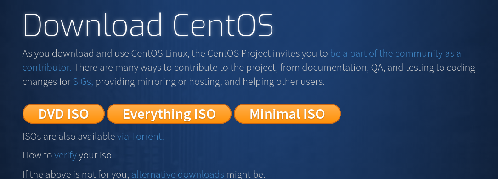

先到 **CentOS** 官网上下载 **Minimal ISO**。

然后安装 **VirtualBox**。

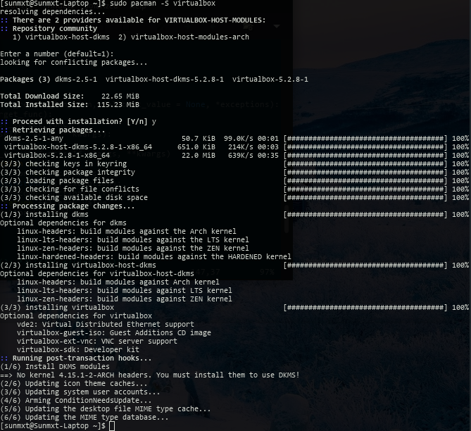

---

#### 安装过程

首先在 VB 新建一个虚拟机。

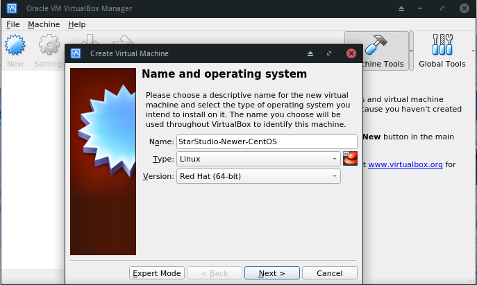

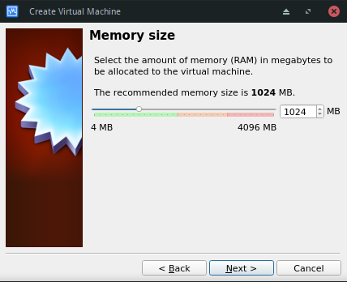

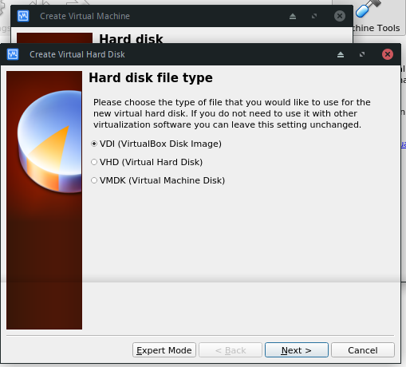

对于不装桌面环境的练习机来说，8G的虚拟磁盘也够玩一段时间了（其实是我的硬盘没空间了，吐血）。

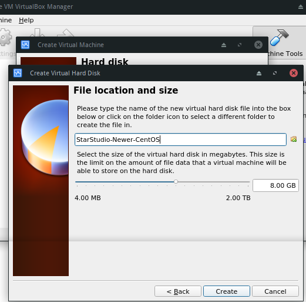

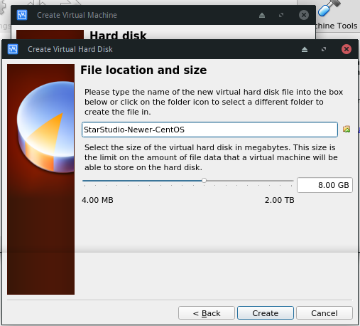

​

- **开始安装 CentOS**

  装载ISO。VM 启动！

  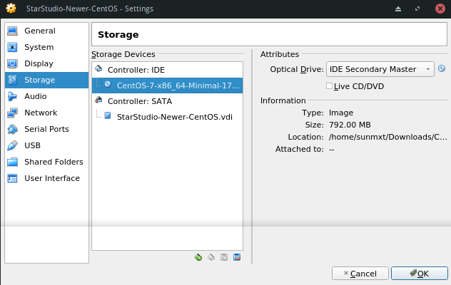

  然后很不幸的遇到了驱动问题。

  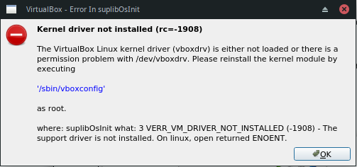

  然后开始了折腾，**lsmod | grep 'vbox' ** 发现驱动没挂上，于是尝试 **modprobe**，报 Exec format error。自从安装 Archlinux 之后内核就没更新过，VB 的 kernel 驱动选的是 DKMS 版本，但 linux-headers 与当前的内核版本不符，所以估计是内核版本问题。尝试其他版本的驱动，还有 Wiki 上各种方法，无果，无奈之下只能滚了内核。意料之内，驱动顺利挂上了。然后就可以开始安装 **CentOS** 了。

  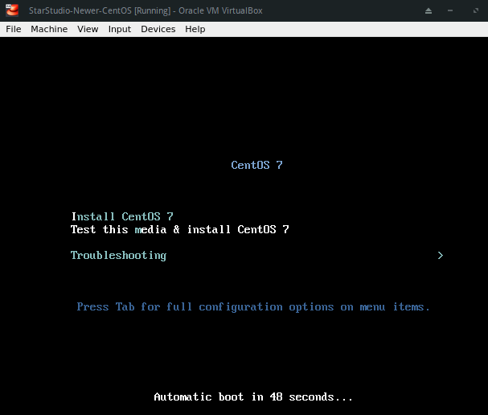

  **CentOS** 的安装程序还是相当友好的，一切都能在 X 界面下搞定。首先选择语言。

  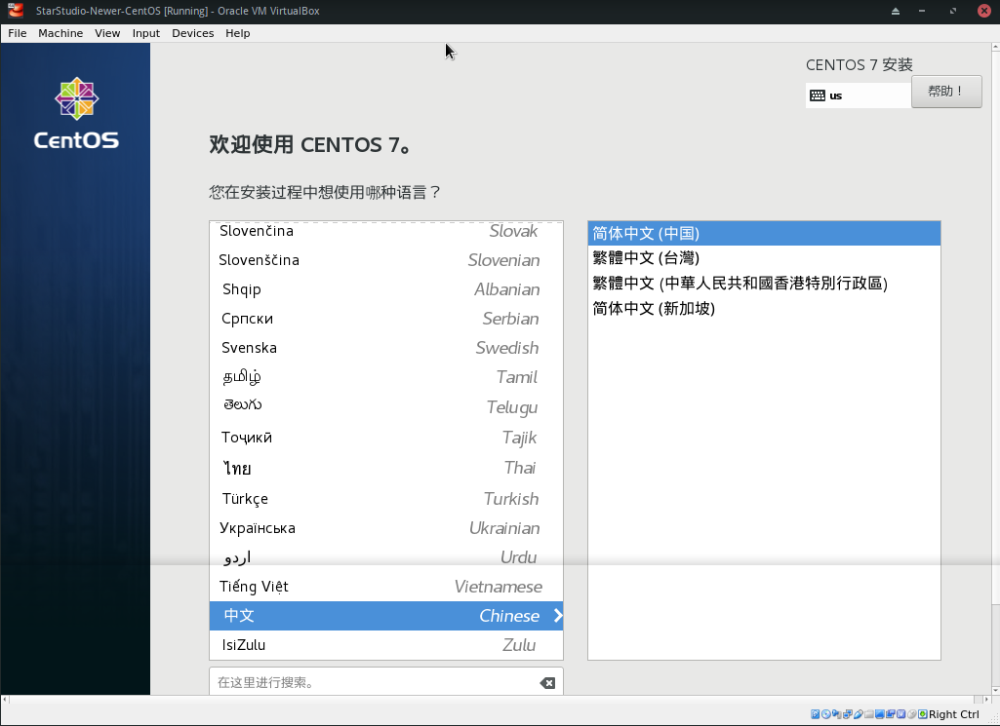

  然后进入安装前的配置过程，时区、键盘和其他配置什么的很多都已经默认选好了，对网络进行配置之后就能直接进入分区过程。

  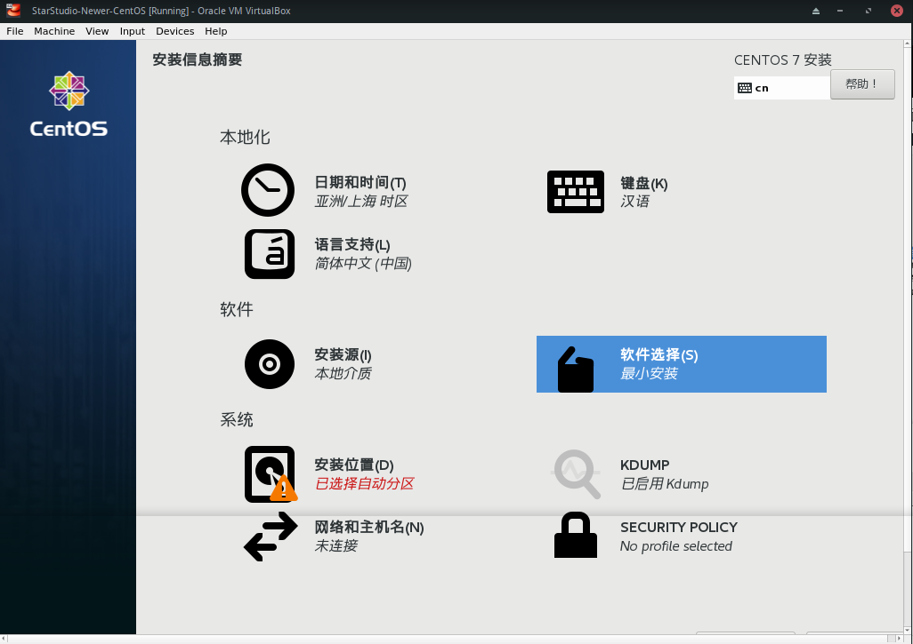

  

  先独立分出 */boot* 分区，避免别的分区挂了之后连引导进 rescue 模式都成问题。

  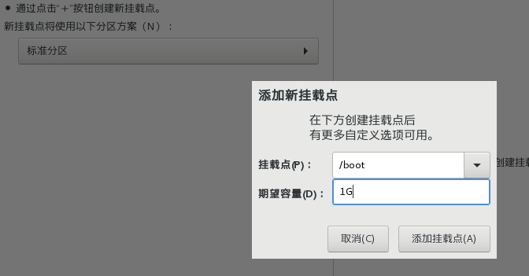

  

  然后分出BIOS Boot。

  

  再分出Swap 分区。Swap分区在物理内存容量告急的时候是很有用的。原则上说越大越好，但是实际上太大也用不完，所以一般都是酌情定分区大小。常见的大小就是与物理内存大小一致，许多文档都是这样推荐的。

  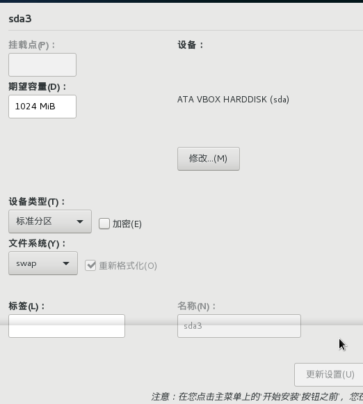

  最后剩余空间单独分出，作为根目录挂载。

  

  最后的方案如下。

  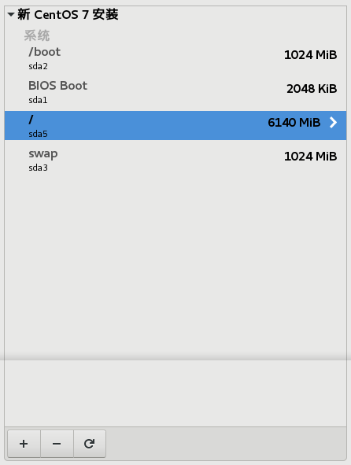

然后就开始安装了。安装过程顺便把Root密码给配置一下，再建一个常用账户。

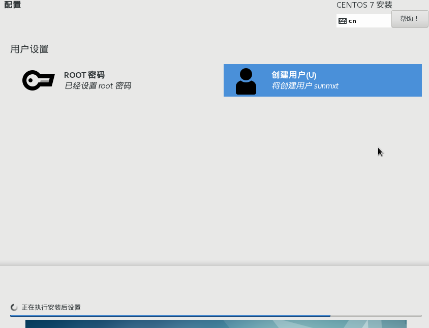

然后就是漫长的等待了。一段时间后重启就完成安装了。很无聊的过程。

---

### 基本配置

装完后什么都没有，**ifconfig** 也没法用，只有 **ip**。VB 的网卡模式为 NAT，先 DHCP 获取地址，装一些基本的东西。

```bash
dhclient
```

安装 **net-tools** ，**vim**，**systemd-networkd**。

```bash
yum install vim net-tools systemd-networkd
```

###### 配置网络

设置虚拟机为网桥模式，重启VM，笔记本的无线网卡不支持混杂模式，要实现虚拟机与物理机的相互访问，还有广域网的访问，有些麻烦，只能想办法做 NAT 。

- **配置物理机**

  感慨一切都在变化，现在 **CentOS** 也走上了 **systemd** 的道路了，可能是大势所趋？

  笔记本的 Arch 的是用 **systemd-networkd**  管理网络配置的。在 **/etc/systemd/network**/**wlan.network**，添加如下内容：

  ```
  [Match]
  MACAddress=ec:55:f9:3e:1e:8b

  [Network]
  DHCP=yes
  Address=192.168.29.1/24
  ```

  ​

- **解决路由问题**

  开启 Linux 内核的 IP 转发。因为在桥接后，两机在同一链路上，需要禁止 ICMP Redirect，以保证虚拟机的数据包全都经过物理机器.

  ```bash
  sysctl net.ipv4.ip_forward=1
  sysctl net.ipv4.conf.wlp3s0.send_redirect=0
  sysctl net.ipv4.conf.wlp3s0.secure_redirect=0
  sysctl net.ipv4.conf.wlp3s0.accept_redirect=0
  ```

  最好还是写到 **/etc/sysctl.d/** 目录下。

  ```
  net.ipv4.ip_forward=1
  net.ipv4.conf.wlp3s0.send_redirect=0
  net.ipv4.conf.wlp3s0.secure_redirect=0
  net.ipv4.conf.wlp3s0.accept_redirect=0
  ```

  在 iptables 做出口的 NAT（必须）。因为 UESTC-WiFi 似乎给我分配的是广域网IP。

  ```
  iptables -A POSTROUTING -t nat --source 192.168.29.1/24 -j MASQUERADE
  ```

- **解决 DNS 问题**

  用 dnsmasq 建个 DNS 服务器。

  ```bash
  sudo pacman -S dnsmasq
  ```

  在 dnsmasq.conf 设置:

  ```
  resolv-file=/etc/resolv.conf
  ```

- **虚拟机的网络**

  虚拟机设置静态 IP：192.168.29.10/24，网关为 192.168.29.1。

  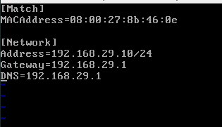

  ```bash
  systemctl restart systemd-networkd
  ```

  检查一下路由表：

  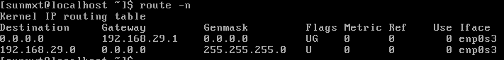

  基本没什么问题。

  然后测试是否能互联。

  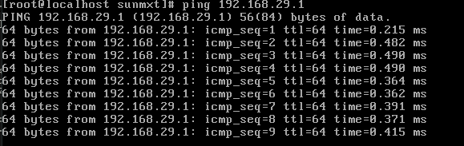

  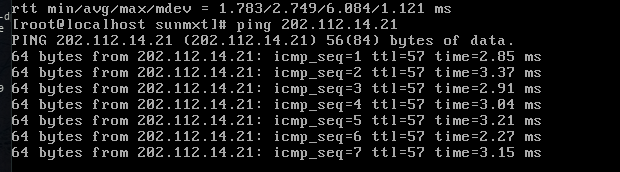

  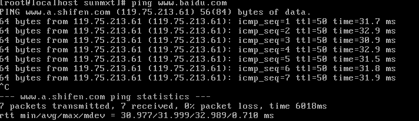

  基本没有问题。

---

#### 搭建LNMP

**CentOS 7** 自带的源，RPM 包并不是很全，搜了下，**nginx** 好像没找到。这种情况在我看来有三种解决方法：**Tarball**、**自己打包 RPM 包**、**换源**。Tarball 安装并不好维护，想起曾经在 VPS 上打包 shadowsocks 的经历，依赖问题真是吐血，放弃了，依赖什么的还是丢给 RPM 吧。曾经听说过 EPEL 源，用 yum 查了一下，还真的有，于是就装上了。

```
yum install epel
```

再查一下  **nginx**、**mariadb** (mysql 的一个分支)、**php-fpm**、**php-mysql**，都有了。

```
yum install mariadb nginx php-fpm php-mysql mariadb-server
```

- **配置 Nginx**

  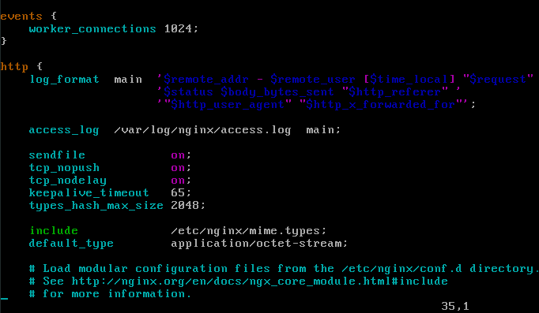

  **Nginx** 配置文件包含了很多默认选项。关注 http 块。

  - **access_log** 设定了访问日志文件的路径，一般不改 **log_format**，除非有特殊需求。

  - **sendfile** 设置是否使用 **sendfile()** 函数。**sendfile()** 是 Linux 提供的一个在两个文件描述符之间拷贝数据的接口，比直接的 **read()**，**write()** 更高效。属于调优选项。

  - **tcp_nopush**，**tcp_nodelay** 设置了 TCP 连接的一些特性。我只略微了解 No Delay 特性，阐述起来比较复杂，不赘述了。

  - **keepalive_timeout** 也是 TCP 长连接的特性，主要是超时断开连接。

  - **types_hash_max_size** 官方文档解释是 types 散列表的大小，部署先不关注它。

  - **include** 可引入另一个配置文件。mime.types 主要是做文件类型和MIME Type 做映射的。官方文档都能查到解释。参考：[https://nginx.org/en/docs/http/ngx_http_core_module.html#default_type](https://nginx.org/en/docs/http/ngx_http_core_module.html#default_type)

    如果一个文件没找到对应的 MIME Type ，就会使用 **default_type** 所指定的类型

  再看 Server 块。Server 块是主要配置的部分。

  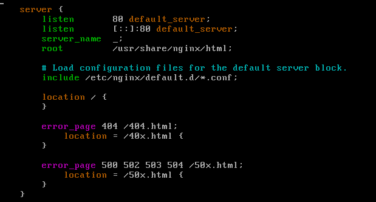

  - **listen** 指定 HTTP 服务端口。**default_server** 时没找到 HTTP Host 头部指定的服务器时候所对应的端口。两行各是 IPv4 和 IPv6 的监听端口。
  - **server_name** 是服务器名。与请求时的 Host 字段对应。支持通配符。
  - **root** 设置了查找文件时候的根目录。有点像工作目录。
  - **location** 字段一般有多个。主要设请求 URL 和返回内容的设置。选项非常的多，参考[官方文档](https://nginx.org/en/docs/http/ngx_http_core_module.html#location)。
  - **error_page** 则是出错时的规则设定。

  ​官方文档也很详细地描述了其他选项。修改 nginx 的配置文件，让其将 PHP 请求转到 **php-fpm**：

  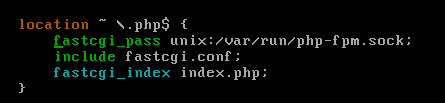

  然后启动 **php-fpm** 和 **nginx**。

  ```bash
  systemctl enable php-fpm
  systemctl start php-fpm
  systemctl enable nginx
  systemctl start nginx
  ```

  然后在物理机尝试访问虚拟机。发现没有响应。在虚拟机 curl 看一看：

  ```bash
  curl 127.0.0.1
  ```

  发现正常返回了 index 页面。仔细一想，会不会是防火墙把请求给拦截了。**iptables-save** 一看，发现了好多的预设链，而且好像有特别的含义。Google 一下，**CentOS 7** 好像有更高级的 **firewalld** 。于是去粗略查了 **firewalld** 的文档。把 HTTP 服务加入到 zone 中：

  ```bash
  [root@localhost sunmxt]# firewall-cmd --get-default
  public
  [root@localhost sunmxt]# firewall-cmd --zone=public --add-service=http
  success
  [root@localhost sunmxt]# firewall-cmd --zone=public --add-service=http --permanent
  success
  ```

  再次访问，一切正常了。

  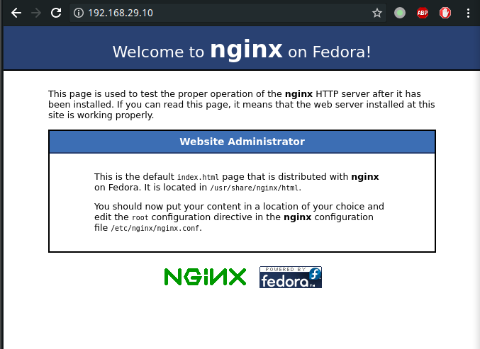

- **测试 php-fpm**

  在 */usr/share/nginx/html* 新建 version.php。

  ```php
  <?php phpinfo(); ?>
  ```

   然后测试。

  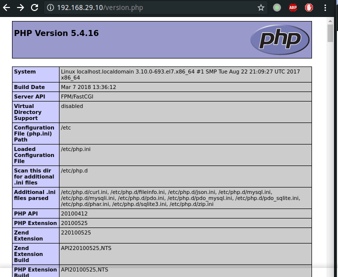

- **配置 Mysql** 

   先看配置文件。

  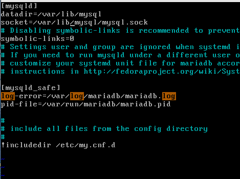

  可见默认监听端口已经设置为 Unix Socket 形式了。不用做特别的设置。

  ```bash
  systemctl enable mariadb
  systemctl start mariadb
  ```

  设置 root 账户密码：

  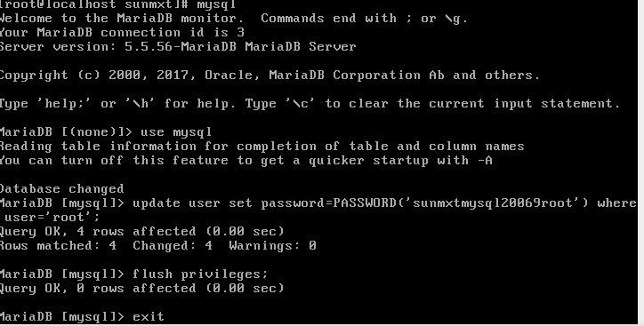

至此 **LNMP** 环境搭建完毕。

---

#### 后记

一边折腾，一边 Markdown，花了三晚时间，效率有点低，似乎不少时间都花在码字上了。自己偶然接触 Ubuntu，后日常使用 Arch，但应用层倒腾得并不多，也没接触过生产环境，服务器系统倒腾过 CentOS 6，不知道 CentOS 7 已经发生了不少变化，也许这也是低效的原因之一吧。选择 DevOps 可能是自己爱倒腾的缘故吧，当然，也知道 DevOps 远远不是倒腾，而是要减少倒腾。 实际上这份记录在周二晚就已经基本完成，而是自己一直在犹豫要不要做尝试，也许是因为自己有点内向、自卑有关吧。想想也该尝试去改变了。不管结果怎样，最后还是下定决心尝试。总之，这就告一段落了。

**共勉。**

---

*于 2018/3/22 22:37*